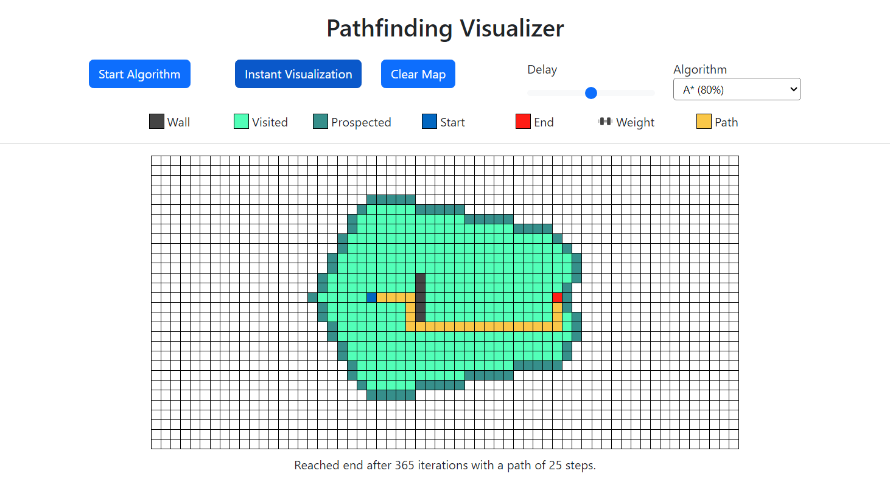

# Pathfinding Visualizer🏴

A pathfinding algorithm visualizer built on Angular. With this project, my goal is to majorly improve my skills and knowledge on Angular. 
Not only that, but I aim to completely overhaul my former <a href="https://github.com/MiguelFirmino/Dijkstra-Visualizer/tree/master">Dijkstra Visualizer</a> 
project to a better, optimized, more professional version by applying Angular's powerful tools.

## Instructions📜

To check out this app go to <a href="https://pathfinding-visualizer-two.vercel.app/">Pathfinding Visualizer</a>.

1) Control the grid by clicking and dragging on it.
2) Press the buttons on the header to visualize the chosen algorithm.
3) Adjust the algorithm delay if needed(the more delay the slower the algorithm will run).
4) Have fun!

## 🚧 Work in progress! 🚧

🚩 Done: 🚩
- [x] implemented Dijkstra, A* and Depth First Search.
- [x] implemented dynamic map controlling.
- [x] implemented basic animations and node styling.
- [x] implemented map creation and clearing.
- [x] implemented click/drag dynamic controlling.
- [x] improved node animations.
- [x] implemented instantaneous visualization:
- [x] added better color palette to grid.
- [x] deployed project to vercel!
- [x] added footer.
- [x] added weights(nodes that are more costly to go through).
- [x] add Bootstrap CSS.

🚩 To do: 🚩
- [ ] figure out a way to modularize node-map-component.ts:
  - [x] created services for each algorithm.
- [ ]  add in-app instructions.
- improve readability of everything(it's never readable enough).

🚩 Maybe: 🚩
- [ ] implement simultaneous algorithm comparing!
- [ ] add pop-ups with info about the algorithm.
- [ ] add bidirectional swarm algorithm.
- [ ] make app mobile friendly!

## Preview🏳️

Here can be seen the process behind finding the best path for an A* Algorithm with 0.8 weight.

 </img>

## Concepts Applied🏴

- Angular's Property Binding.
- CSS Animation, Transition.
- Typescript Class Inheritance(OOP).
- Bootstrap Grid System, Typography.
- Dijkstra, A* and Depth First Search Algorithms.
